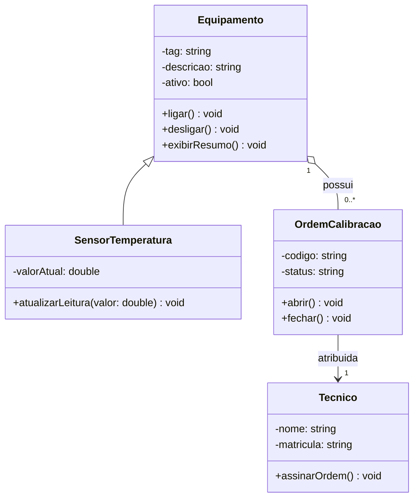

# Diagrama de Classe - Entrega do Aluno

## 1. Requisito resumido

O problema consiste em modelar um sistema de gerenciamento para um laboratório de ensaios metrológicos. O sistema precisa controlar ativos físicos (equipamentos genéricos e sensores especializados de temperatura) registrando suas identificações, descrições e estados de ativação. Para garantir a confiabilidade das medições, o laboratório gerencia ordens de calibração vinculadas aos equipamentos que necessitam de verificação. Por fim, o sistema rastreia os técnicos qualificados do laboratório, associando-os explicitamente como responsáveis pela execução e assinatura de cada ordem de calibração aberta.

## 2. Link do Mermaid Live

https://mermaid.ink/img/pako:eNqFU1GP0zAM_iuVnw5undqxdl2EkNDBGwgJ7unUF7fxuogmGU4yHTf230mnDd16BfJk-7O_z3aSA7RWEghoe3Tug8KOUddcmySeUyz5-COoHWoy3iaHCzSc1GMnEudZme4qLsm1rFq0kyh6tY9IY23_PH7bqw755lWyt0peAZHurxg9qkbxV3JB2xF-HIzrUb6RcZbvSe-I0QfG0UB77C2_9wF7kUgbmp6uxHBA1BPyJ1JD9c0p_5L6X_UvLEnfRYaGMS5npB3vQXXTG3M-Krsp6BYbVpOL2VC7fbGyiabuqTWqHTdjrKbJVjTGWBt6nO7GOWWQT4P-S_r5k3r7K01fXsxUZg15DYmN6TVk8_nr6IxXKpKddS6oS_kYT9N3Z5rL3CIZJmqCkggz6FhJEJ4DzUATaxxcOAxkNfgtaapBRFMif6-hNsdYs0PzYK2-lLEN3RbEBnsXvbCT6On8r_6kkJHEdzYYD2K5PFGAOMAjiKKar1ZVvi7LYlVl2aqawU8QaTnPq3WVlcVi-SYrimgcZ_B0Us3neZYX5aLKF1W2zspF5COpvOXP559tzUZ1cPwNq4A6SA?type=png

https://mermaid.live/edit#pako:eNqFU8Fu2zAM_RWDp3aNAzuNHUcYBgzdbhsGbD0NvtAW6wizpIySgq5Z_n1ykAyN6626mOQj-fgoaw-tlQQC2h6d-6CwY9Q11yaJ5xhLPv4MaouajLfJ_gwNJ_XYicR5Vqa7iEtyLasW7SSKXu0i0ljbP4_f9KpDvrpOdlbJCyC2-ydGj6pR_JVc0HaEHwbjUso3Ms7yPektMfrAOBK0w97yex-wF4m0oenpggwHRD0hfyI1VF8d88-pr7J_YUn6LnZoGONyRtzxHlQ3vTHnI7Obgm6wYTW5mAdqNy9WNjHUPbVGteNhjNU0OYrGGGtDj9PTOKcM8lHo_6if_1Jvf6fpy4uZyqwhryGxMb2GbD5_E53xSkWytc4FdS4f42n67tTmrFskg6ImKIkwg46VBOE50Aw0scbBhf3QrAa_IU01iGhK5B811OYQa7Zovlurz2VsQ7cB8YC9i17YSvR0eld_U8hI4jsbjAexvD22ALGHRxBFNV-tqnxdlsWqyrJVNYNfINJynlfrKiuLxfI2K4poHGbwdGTN53mWF-WiyhdVts7KxXIGJJW3_Pn0sofP4Q82ZDls

## 3. Diagrama final em Mermaid

## 4. Justificativa das relacoes

Explique, em frases curtas:

Por que houve generalização: A classe SensorTemperatura herda de Equipamento porque um sensor é um tipo especializado de ativo no laboratório. Ele compartilha os atributos comuns (tag, descricao, ativo) e métodos de ciclo de vida (ligar(), desligar()), adicionando apenas a medição física (valorAtual).

Por que houve agregação: A relação entre Equipamento e OrdemCalibracao foi modelada como uma Agregação (o--). Uma ordem de calibração está vinculada a um equipamento, mas se a ordem for concluída ou arquivada, o equipamento físico continua existindo no inventário do laboratório.

Por que a cardinalidade foi escolhida: - Um Equipamento pode possuir de zero a várias (0..*) ordens de calibração ao longo de sua vida útil, enquanto cada OrdemCalibracao pertence a exatamente (1) equipamento específico.

Cada OrdemCalibracao é atribuída a exatamente (1) Tecnico responsável, enquanto um técnico pode estar associado a nenhuma ou a várias ordens no sistema.

Por que as classes fazem sentido no domínio: Elas mapeiam de forma enxuta os pilares de um laboratório de calibração industrial: o objeto que sofre a medição (Equipamento), o instrumento de teste especializado (SensorTemperatura), o documento de rastreabilidade (OrdemCalibracao) e o operador qualificado (Tecnico).

## 5. Linguagem escolhida

Marque a trilha usada:

- [x] C++
- [ ] Python

## 6. Evidencias de execucao

[Equipamento] Tag: EQ-01 | Descricao: Agitador principal | Ativo: Sim
[Sensor Temperatura] Tag: TT-01 | Status: Ligado | Temperatura: 23.5 °C
[Sensor Temperatura] Tag: TT-01 | Status: Ligado | Temperatura: 24.2 °C