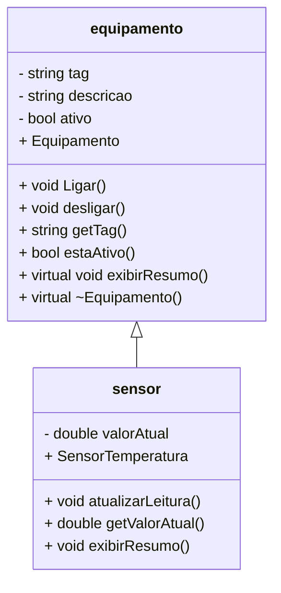

```mermaid
classDiagram
equipamento<|--sensor
class equipamento{
    - string tag
    - string descricao
    - bool ativo
    + Equipamento
    + void Ligar()
    + void desligar()
    + string getTag()
    + bool estaAtivo()
    + virtual void exibirResumo()
    + virtual ~Equipamento()
}


class sensor{
    - double valorAtual
    + SensorTemperatura
    + void atualizarLeitura()
    + double getValorAtual()
    + void exibirResumo()
}
```